*Langkah-langkah Praktikum*

Persiapan membuat dokumen HTML dengan nama file `lab3_list.html` seperti berikut

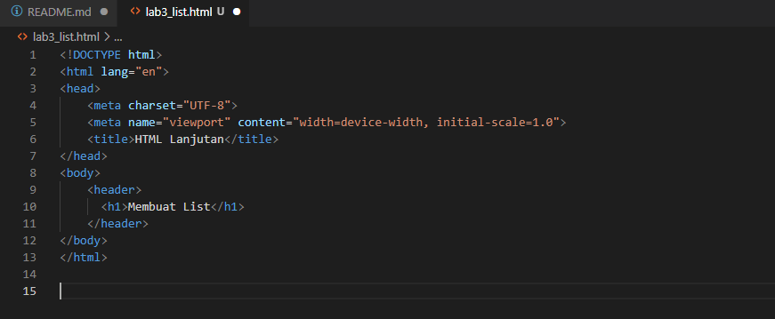

*Membuat Ordered List*

Kemudian tambahkan kode untuk membuat **Ordered List** seperti berikut

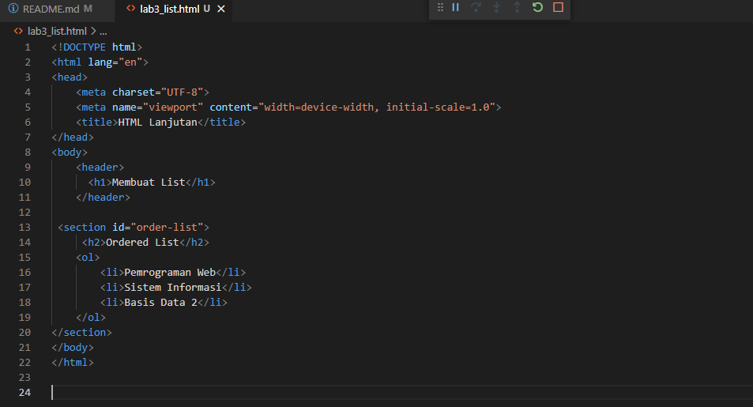

Maka tampilan ordered list akan seperti ini

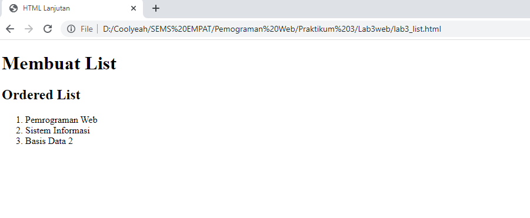

*Membuat Unordered List*

Kemudian tambahkan kode untuk membuat **Unurdored List**, setelah deklarasi ordered list pada section **unordered-list**, seperti berikut

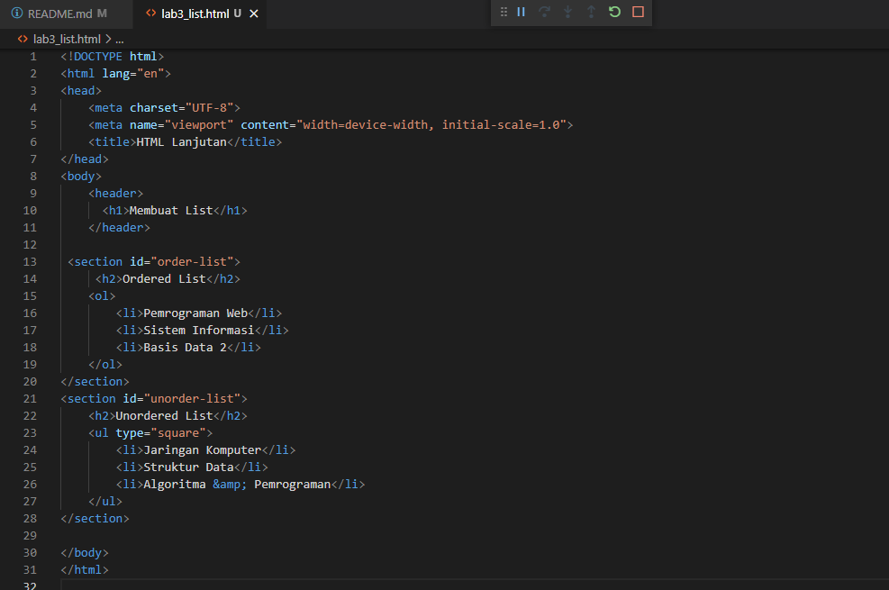

Tampilan unordered list

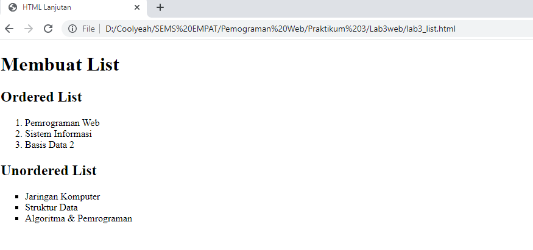

*Membuat Description List*

Kemudian tambahkan kode untuk membuat description list setelah deklarasi unordered-list

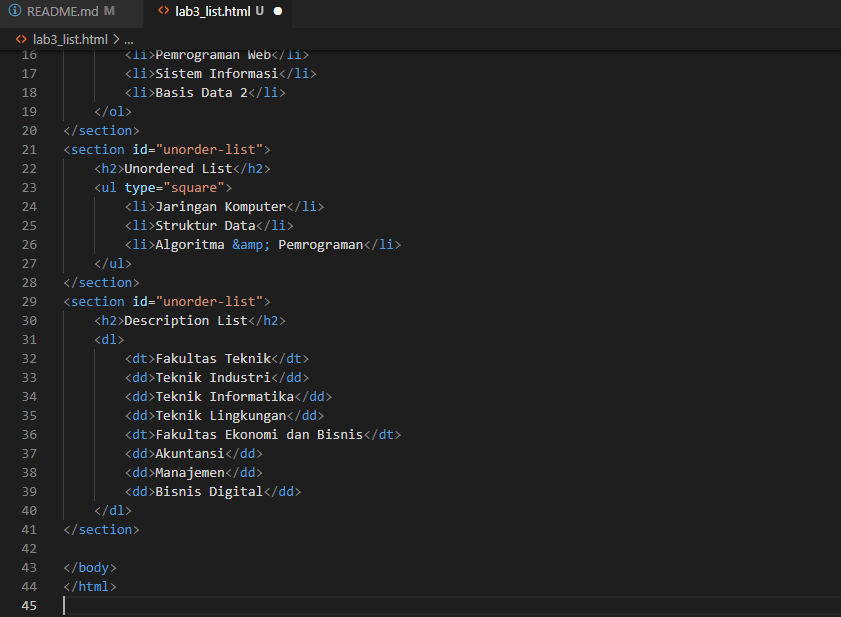

Tampilan description list

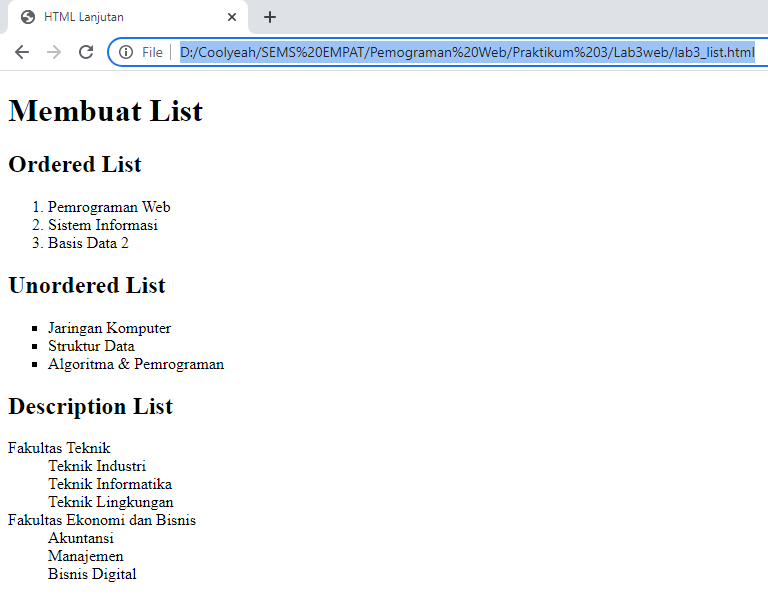

*Membuat Tabel*

Buat file baru dengan nama `lab3_tabel.html`. Kemudian selanjutnya tambahkan kode untuk membuat tabel sederhana dan mengatur **Margin dan Padding**, tambahkan atribut **cellpadding** dan **cellspacing** pada tag tabel

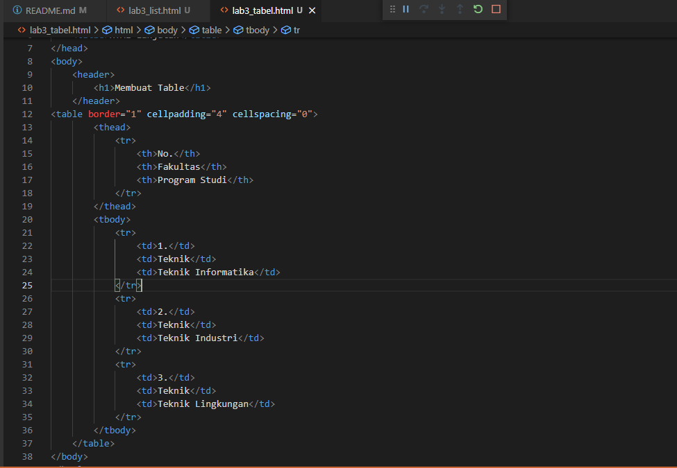

Tampilan membuat tabel dan penggunaan cellpadding

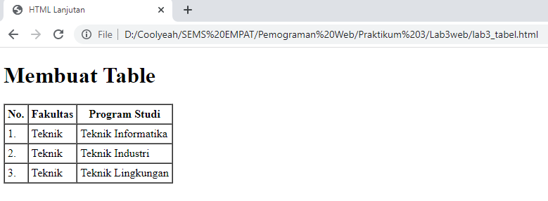

*Menggabungkan sel data*

Untuk menggabungkan sel data, gunakan atribut rowspan dan colspan. Atribut rowspan untuk
menggabungkan baris (secara vertikal) dan colspan untuk menggabungkan kolom (secara
horizontal).

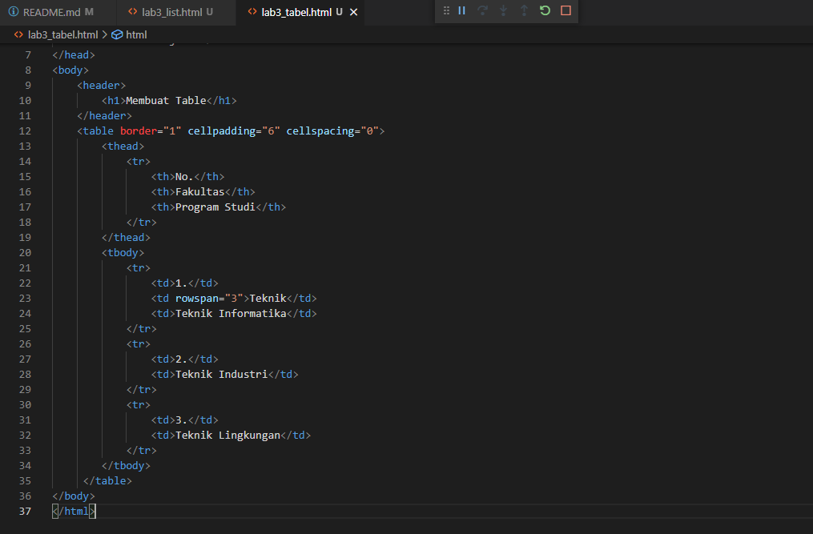

Tampilan untuk penggabungan sel

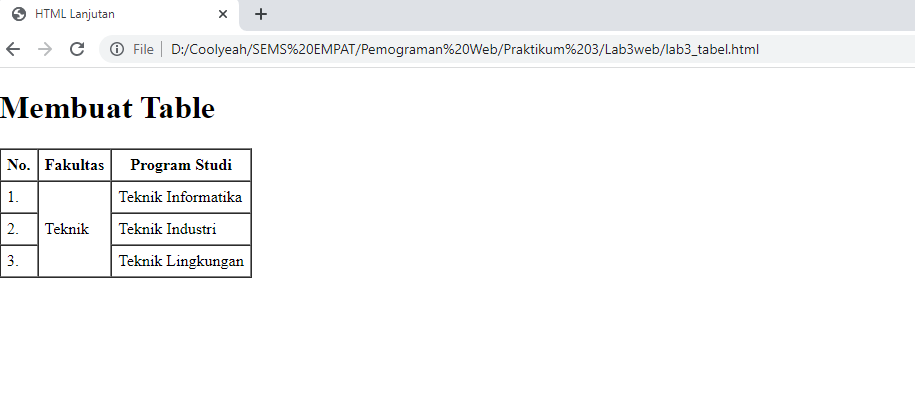

*Membuat Form*

Buat file baru dengan nama `lab3_form.html

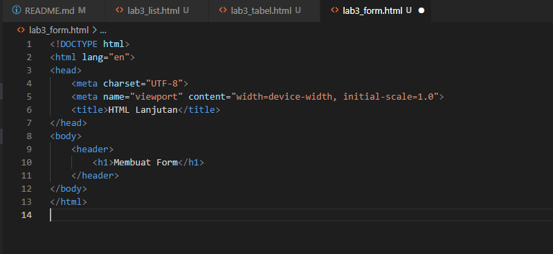

Kemudian selanjutnya tambahkan kode untuk membuat tabel sederhana seperti berikut

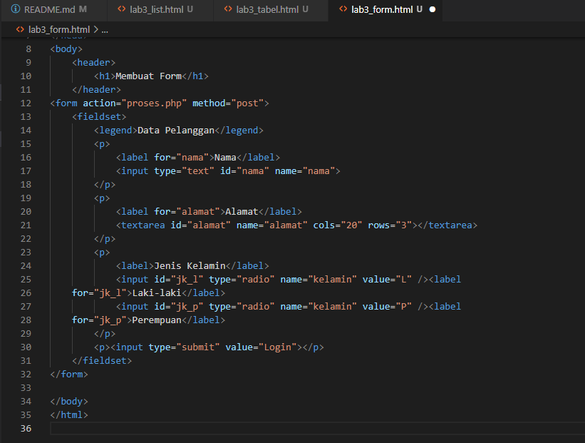

Tampilan membuat form

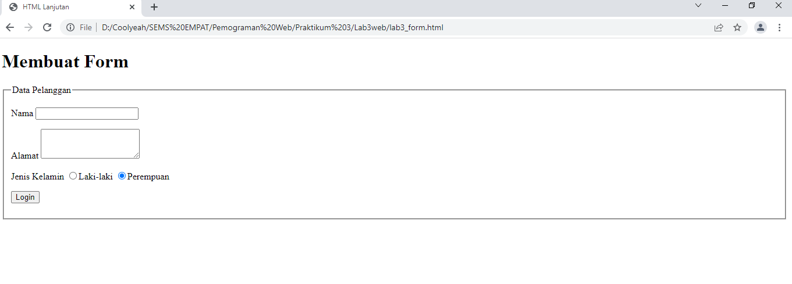

*Menambahkan Style pada Form*

Agar tampilan form lebih menarik, bisa ditambahkan CSS seperti berikut

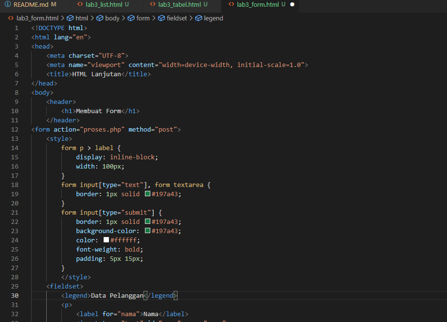

Tampilan Form dengan CSS

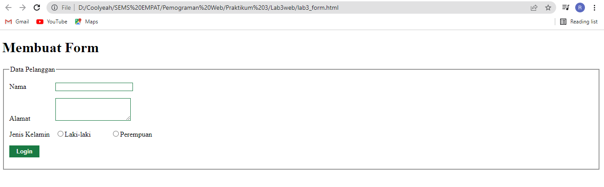

**Pertanyaan dan Tugas**

1. Buatlah form yang menampilkan *Dropdown* menu dan *Listbox* dengan **multiple section**

*Syntax **Dropdown** menu*

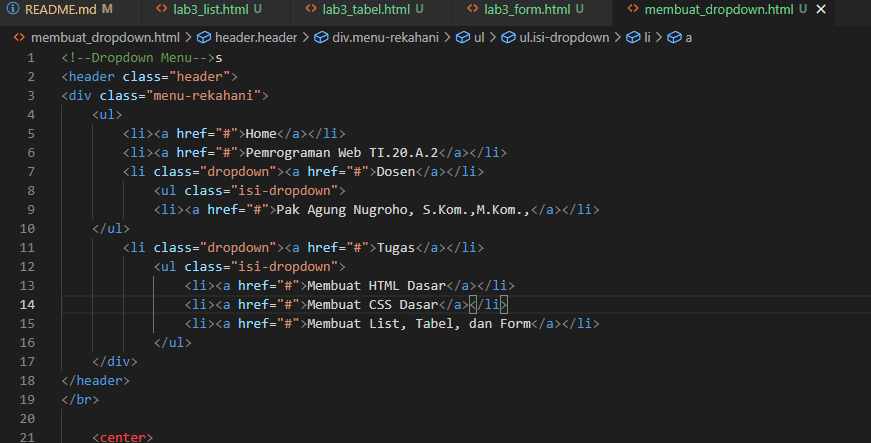

Tampilan **Dropdown** menu

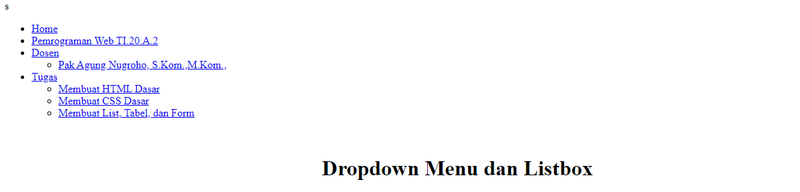

*Syntax* **Listbox** dengan **multiple section**

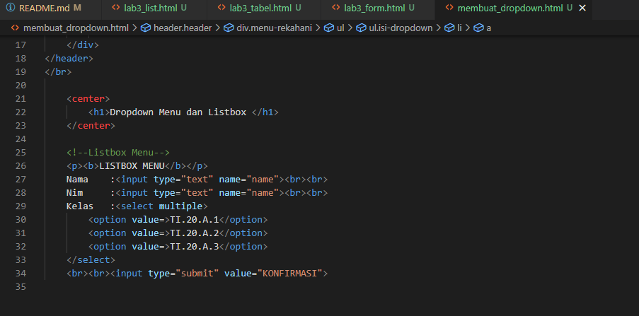

Tampilan **Listbox** dengan **multiple section**

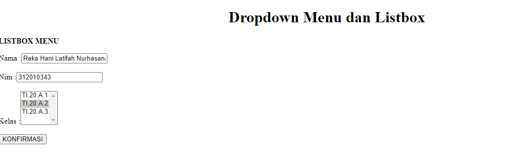
